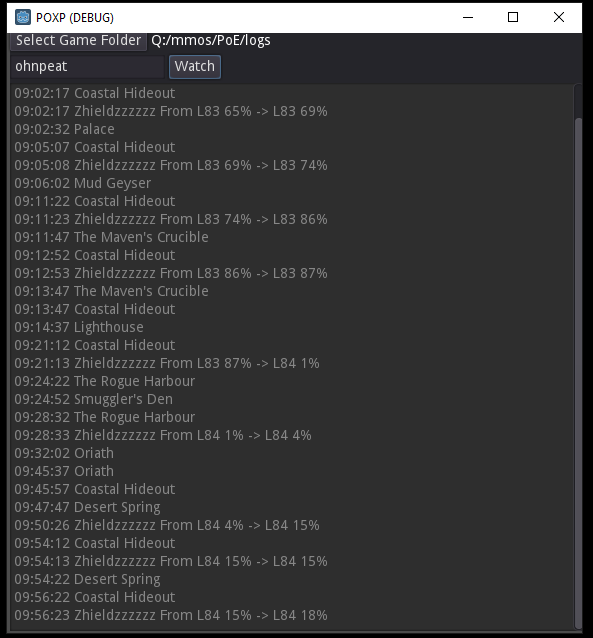

# POXP
## Path of Exile Desktop XP Tracker ##

I've shared as a proof-of-concept only - I've no plans to develop this as-is

I have continued this idea in a Python-based app which is [available here](https://github.com/shrewdlogarithm/PoE-Character-Log-Desktop) - this has additional features etc.

### What it Does ###
Watches your Client.txt (log file) and when you zone, checks your Profile via the API and reports which characters have gained (or lost) XP

This basically means it shows you how much XP (% of level) you earned in the last area/map

## I don't recognize the code ##
It's a project for a game-creator called [Godot](https://godotengine.org/)  
Why?  Because it creates small executables for Windows/Linux/Mac and it's free/easy for anyone to use!  

## Where's the download? ##
Currently there's only a Windows exe in the Releases list - if other people would like to test/build this for other platforms, that'd be great!

## How to use ##
Run the project, select your PoE 'logs' directory and enter your accountname (must have a public profile)  
Your Client.txt file will be scanned every 5s - when you change zone your profile will also be scanned and changes will be reported  
You can also press "Check Now" to read your log AND profile instantly (don't SPAM this!!)  

## Won't this flood the API? ##
If you spam the 'Check Now' button - yes it will!    
Otherwise the API is accessed once per change-of-zone and no more than once every 5s which should be fine.
